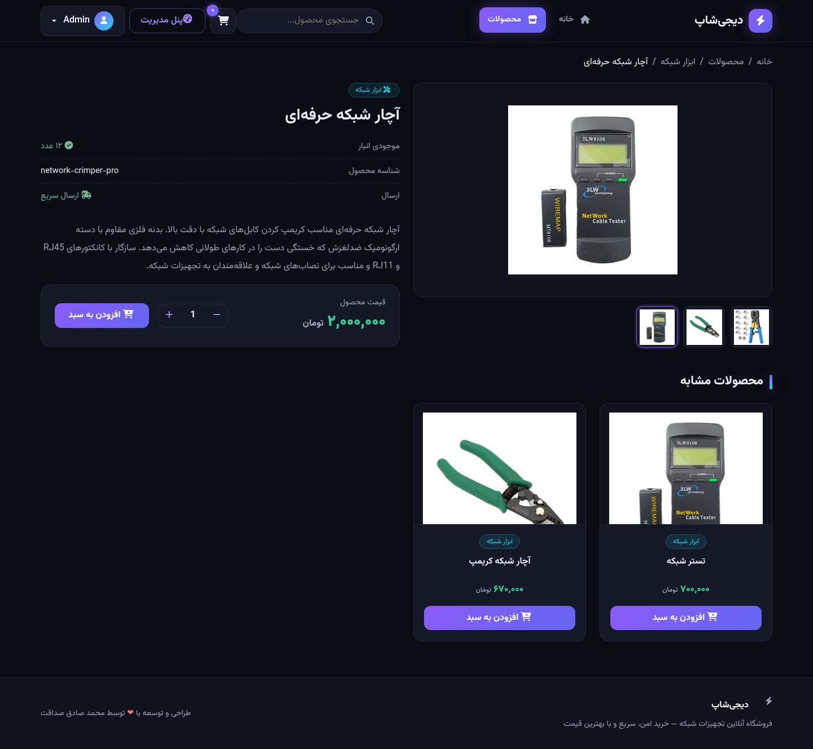
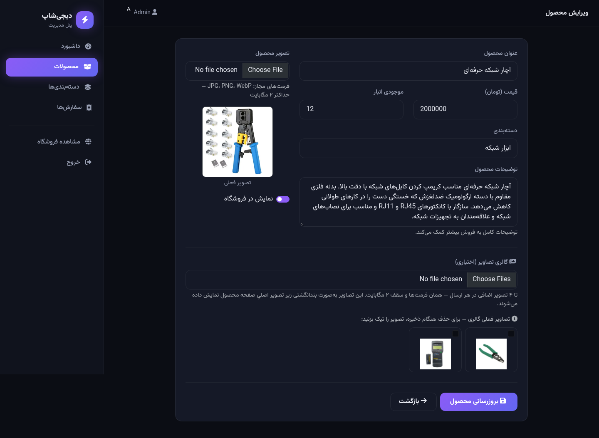

<div dir="rtl" align="center">

# ⚡ دیجی‌شاپ

**فروشگاه آنلاین تجهیزات شبکه — ساخته‌شده با Laravel**

[](https://laravel.com)
[](https://php.net)
[](https://github.com/MSS1625/shop-php/actions/workflows/ci.yml)
[](../../releases)
[](LICENSE)
[](CONTRIBUTING.md)

فروشگاه اینترنتی کامل با پنل مدیریت، سبد خرید، پرداخت آنلاین زرین‌پال و مدیریت سفارش‌ها — راست‌چین، فارسی و با طراحی دارک مدرن.

**🌐 پیش‌نمایش آنلاین رابط کاربری:** <https://mss1625.github.io/shop-php/>

</div>

---

[English](README.md) | **فارسی**

---

<div dir="rtl" align="center">

| خانه | محصولات |
|:---:|:---:|
|  |  |

| تسویه‌حساب و پرداخت | درگاه آزمایشی |
|:---:|:---:|
|  |  |

| سفارش‌های من | رهگیری سفارش |
|:---:|:---:|
|  |  |

| داشبورد مدیریت | سفارش‌ها (ادمین) |
|:---:|:---:|
|  |  |

| صفحه محصول (گالری) | فرم گالری در ادمین |
|:---:|:---:|
|  |  |

</div>

## 🌐 پیش‌نمایش آنلاین (GitHub Pages)

یک **صفحه دموی ایستا** از رابط کاربری فروشگاه روی GitHub Pages میزبانی شده است:

> **<https://mss1625.github.io/shop-php/>**

این صفحه صفحهٔ اصلی فروشگاه (هیرو، دسته‌بندی‌ها و کارت‌های محصول) را با محصولات نمونه واقعی بازسازی می‌کند. توجه کنید که GitHub Pages فقط فایل‌های ایستا سرو می‌کند — **نسخه کامل** برنامه (سبد خرید، تسویه‌حساب، پرداخت و پنل مدیریت) با PHP و از راه‌اندازی سریع ۴ فرمانی پایین اجرا می‌شود. لینک پیش‌نمایش در بخش **About** مخزن هم ثبت شده و مستقیم از صفحه پروژه قابل مشاهده است.

## ✨ امکانات

- 💳 **پرداخت آنلاین زرین‌پال** — اتصال کامل به API نسخه ۴ زرین‌پال با تایید سمت سرور، امکان تلاش مجدد پس از خطا + گزینه «پرداخت در محل»؛ همراه با **درگاه آزمایشی محلی** برای تست کل جریان بدون نیاز به پذیرنده
- 👤 **حساب کاربری مشتری** — ثبت‌نام/ورود، داشبورد با آمار خرید، تاریخچه کامل سفارش‌ها و تایم‌لاین پیگیری وضعیت؛ خرید مهمان هم همچنان ممکن است
- 🛒 **سبد خرید کامل** — افزودن/حذف/تغییر تعداد بدون رفرش صفحه (Ajax)
- 📦 **مدیریت سفارش‌ها** — ثبت سفارش، گردش کار وضعیت (در انتظار ← پردازش ← ارسال ← تحویل/لغو)، کاهش و بازگشت خودکار موجودی انبار، لغو سفارش توسط مشتری با بازگشت موجودی
- 🔍 **جستجو، فیلتر و مرتب‌سازی** — جستجوی زنده محصولات، فیلتر دسته‌بندی، مرتب‌سازی بر اساس قیمت و جدیدترین، صفحه‌بندی
- 🗂 **دسته‌بندی‌ها** — دسته‌بندی پویا با آیکون و تعداد محصولات
- 📊 **داشبورد مدیریت** — آمار فروش، نمودار فروش ۷ روز اخیر، هشدار موجودی کم، آخرین سفارش‌ها
- 🖼 **آپلود امن تصویر** — فقط تصاویر معتبر (JPG/PNG/WebP حداکثر ۲ مگابایت) با نام تصادفی
- 🖼️ **گالری تصاویر محصول** — چند تصویر برای هر محصول؛ نوار بندانگشتی در صفحه جزئیات، تصویر اصلی را عوض می‌کند؛ حذف ضد IDOR در ادمین
- 🌐 **کاملاً فارسی** — راست‌چین، فونت وزیرمتن، اعداد فارسی (۰۱۲۳۴۵۶۷۸۹)، واحد تومان
- 🌙 **رابط دارک مدرن** — تم نئونی بنفش بر پایه Bootstrap 5 RTL
- 🔐 **امنیت سخت‌گیرانه** — CSRF، محدودیت ورود، خروجی امن Blade، هدرهای امنیتی و پرداخت اتمیک

## 🚀 راه‌اندازی سریع (SQLite — بدون تنظیمات)

```bash
# ۱) دریافت و نصب وابستگی‌ها
git clone https://github.com/MSS1625/shop-php.git
cd shop-php
composer install

# ۲) نصب یک‌مرحله‌ای (env + کلید + مهاجرت + داده اولیه + لینک تصاویر)
php artisan shop:install

# ۳) ساخت کاربر مدیر (تعاملی)
php artisan admin:create

# ۴) اجرا
php artisan serve
```

حالا **http://localhost:8000** را باز کنید — فروشگاه با ۸ محصول نمونه آماده است. 🎉

## 🛠 راه‌اندازی با XAMPP / MySQL

۱. در phpMyAdmin یک دیتابیس خالی با نام `shop_php` بسازید

۲. در فایل `.env` خط SQLite را کامنت و بخش MySQL را از کامنت خارج کنید:

```env
# DB_CONNECTION=sqlite
DB_CONNECTION=mysql
DB_HOST=127.0.0.1
DB_PORT=3306
DB_DATABASE=shop_php
DB_USERNAME=root
DB_PASSWORD=
```

۳. نصب و اجرا:

```bash
php artisan shop:install
php artisan admin:create
php artisan serve
```

> **پیش‌نیازها:** PHP نسخه 8.2 به بالا با اکستنشن‌های `pdo_sqlite` (یا `pdo_mysql`)، `mbstring`، `gd` و `fileinfo` — همه به‌صورت پیش‌فرض در XAMPP فعال هستند.

## 💳 درگاه پرداخت زرین‌پال

لایه پرداخت بر پایه قرارداد `PaymentGateway` پیاده‌سازی شده و سه حالت با فایل `.env` قابل انتخاب است:

| حالت | مقدار | توضیح |
|---|---|---|
| **آزمایشی محلی** (پیش‌فرض) | `mock` | شبیه‌ساز محلی پرداخت — بدون اینترنت و بدون پذیرنده؛ برای توسعه و دمو |
| **سندباکس** | `sandbox` | محیط آزمایشی زرین‌پال (`sandbox.zarinpal.com`) |
| **واقعی** | `production` | پرداخت واقعی (`payment.zarinpal.com`) |

برای فعال‌سازی پرداخت واقعی، **شناسه پذیرنده** (UUID ۳۶ کاراکتری) را از [پنل زرین‌پال](https://zarinpal.com) بگیرید و تنظیم کنید:

```env
ZARINPAL_MERCHANT_ID=xxxxxxxx-xxxx-xxxx-xxxx-xxxxxxxxxxxx
ZARINPAL_MODE=production
# مبلغ سفارش‌ها «تومان» است و API زرین‌پال «ریال» می‌گیرد؛ ضریب پیش‌فرض ۱۰ است
ZARINPAL_AMOUNT_MULTIPLIER=10
```

**جریان پرداخت:** تکمیل خرید ← ثبت اتمیک سفارش و رزرو موجودی ← هدایت به درگاه ← تایید **سمت سرور** پس از بازگشت (به کوئری‌استرینگ اعتماد نمی‌شود) ← سفارش «پرداخت‌شده» با شماره پیگیری بانکی. پرداخت ناموفق/لغوشده قابل تلاش مجدد است و «پرداخت در محل» هم به‌عنوان گزینه دوم موجود است.

## 🔐 امنیت

| تهدید | راهکار |
|---|---|
| SQL Injection | استفاده کامل از Eloquent ORM و کوئری‌های پارامتری |
| XSS | خروجی امن خودکار Blade — `{{ }}` |
| CSRF | توکن `@csrf` در همه فرم‌ها |
| حمله Brute Force | حداکثر ۵ تلاش ناموفق در دقیقه برای هر ایمیل+IP |
| آپلود فایل خطرناک | اعتبارسنجی تصویر + وایت‌لیست فرمت + محدودیت حجم + نام تصادفی |
| دستکاری پرداخت | نتیجه پرداخت فقط با فراخوانی سرور به سرور (verify) تایید می‌شود |
| دسترسی غیرمجاز به سفارش‌ها | هر سفارش فقط برای مالک آن (یا مدیر) قابل مشاهده است؛ صفحات پرداخت به سشن گره خورده‌اند |
| Session Fixation | بازسازی شناسه سشن هنگام ورود |
| Mass Assignment | لیست سفید `$fillable` در همه مدل‌ها |
| Clickjacking | هدرهای امنیتی استاندارد |

## 📁 ساختار پروژه

```
app/
├── Console/Commands/      # shop:install و admin:create
├── Contracts/             # PaymentGateway (قرارداد درگاه پرداخت)
├── Exceptions/            # StockUnavailable, PaymentGateway, PaymentVerificationFailed
├── Http/
│   ├── Controllers/
│   │   ├── Admin/         # Dashboard, Product, Category, Order
│   │   ├── Auth/          # AdminLogin, Login, Register
│   │   └── Shop/          # Home, Product, Cart, Checkout, Payment, Account
│   ├── Middleware/        # EnsureUserIsAdmin, SecurityHeaders
│   └── Requests/          # اعتبارسنجی فرم‌ها
├── Models/                # Product, Category, Order, OrderItem, User
├── Services/
│   ├── Cart.php           # سرویس سبد خرید مبتنی بر سشن
│   └── Payments/          # ZarinPalGateway, MockGateway
database/seeders/images/   # تصاویر نمونه محصولات
docs/                      # صفحه دموی ایستا برای GitHub Pages
public/assets/             # تم دارک + اسکریپت سبد خرید
resources/views/           # قالب‌های Blade (فروشگاه + ادمین + احراز هویت + حساب)
.github/workflows/ci.yml   # اجرای خودکار تست روی هر push
README.md / README.fa.md   # English | فارسی
```

## 🧪 تست‌ها و CI

```bash
php artisan test        # ۴۳ تست Feature
vendor/bin/pint --test  # بررسی سبک کد
```

روی هر `push` و هر `pull request`، تست‌ها به‌صورت خودکار روی GitHub Actions (PHP 8.2 / 8.3 / 8.4 + Pint) اجرا می‌شوند — بج بالای همین فایل.

## 🗺 نقشه راه

- [x] درگاه پرداخت آنلاین (زرین‌پال)
- [x] حساب کاربری و تاریخچه سفارش‌ها
- [x] GitHub Actions CI
- [x] وب‌سایت پروژه (دموی GitHub Pages)
- [x] گالری تصاویر محصول (چند تصویر)
- [ ] کد تخفیف
- [ ] اطلاع‌رسانی ایمیل/پیامک

## 🤝 مشارکت

پیشنهادها و Pull Request ها خوش‌آمدند! قبل از ارسال `composer test` و `vendor/bin/pint` را اجرا کنید. راهنمای کامل در [CONTRIBUTING.md](CONTRIBUTING.md).

## 👤 نویسنده

**محمد صادق صداقت** — با ❤️

## 📄 مجوز

این پروژه تحت مجوز [MIT](LICENSE) منتشر شده است.
