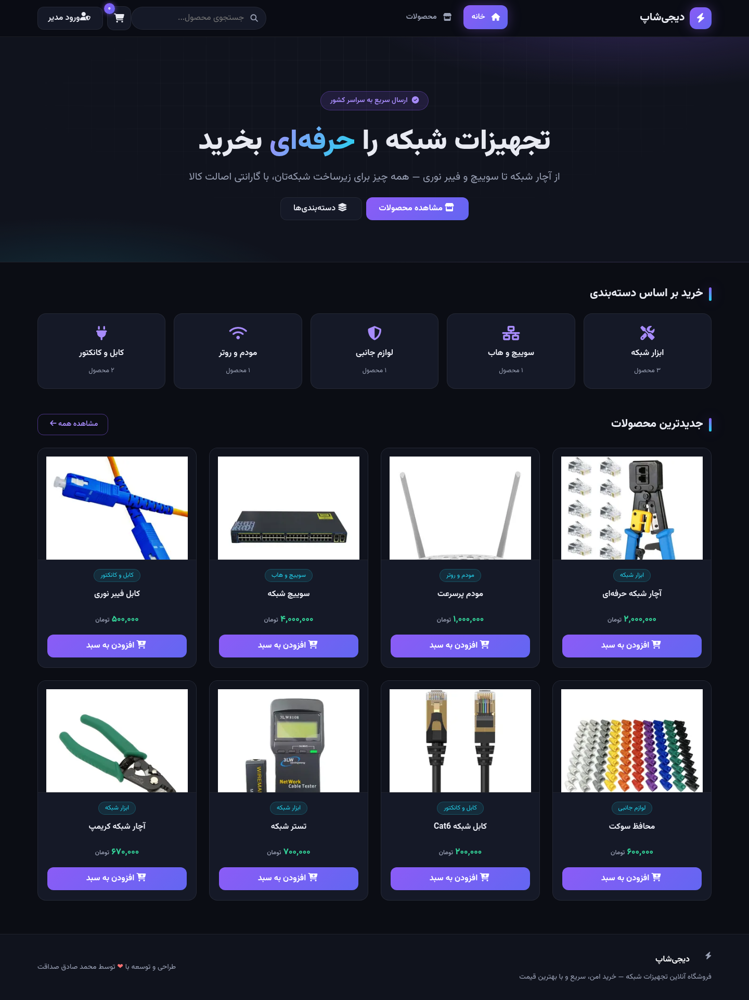
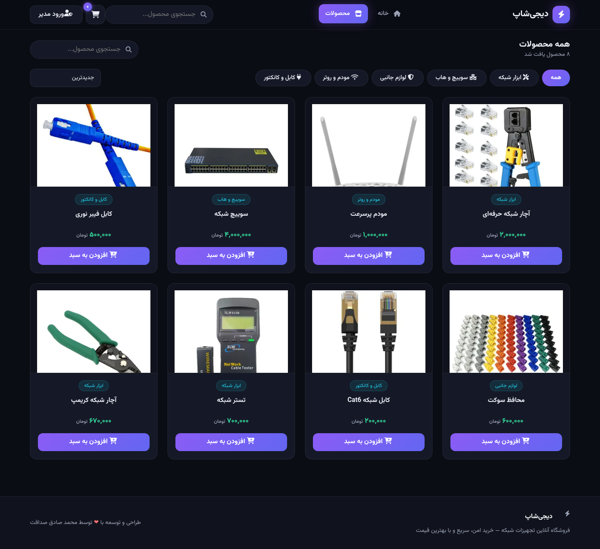
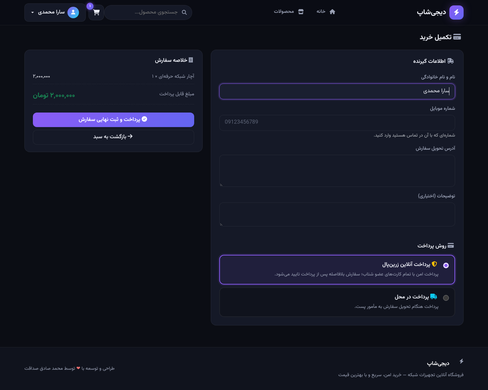
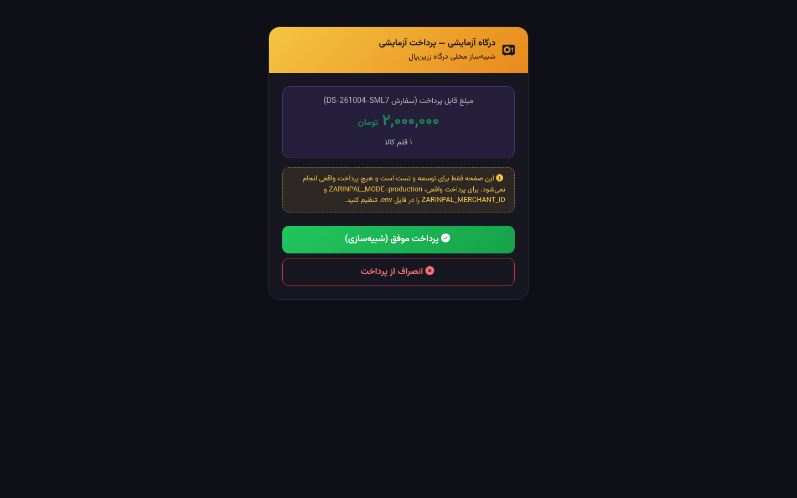
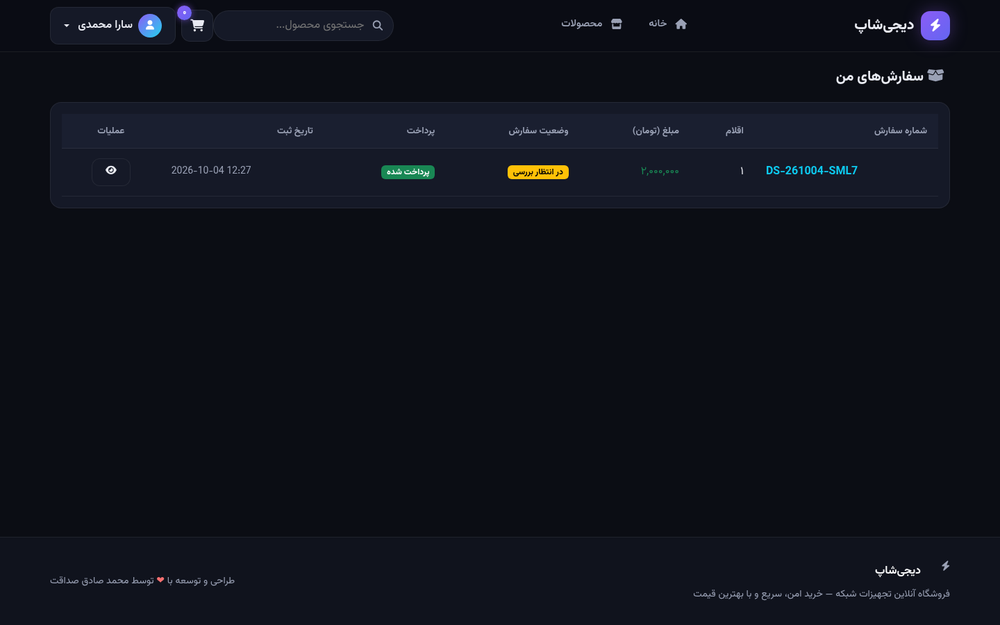
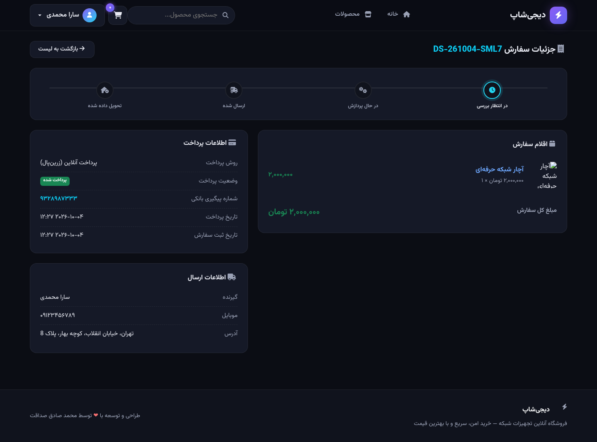
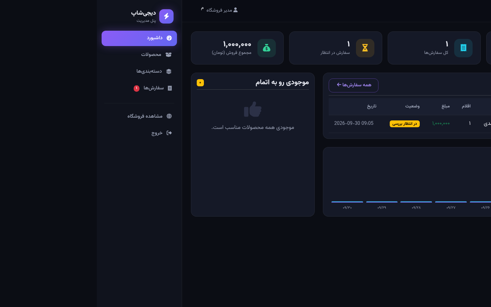
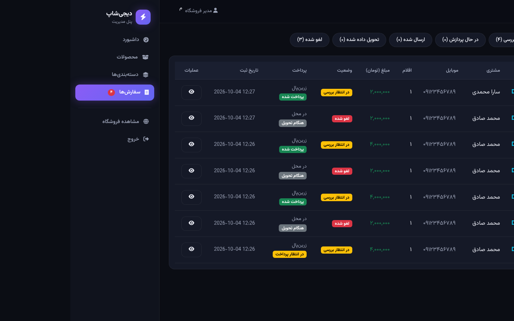

<div dir="rtl" align="center">

# ⚡ دیجی‌شاپ

**فروشگاه آنلاین تجهیزات شبکه — ساخته‌شده با Laravel**

[](https://laravel.com)
[](https://php.net)
[](https://github.com/MSS1625/shop-php/actions/workflows/ci.yml)
[](CHANGELOG.md)
[](LICENSE)
[](CONTRIBUTING.md)

فروشگاه اینترنتی کامل با پنل مدیریت، سبد خرید، پرداخت آنلاین زرین‌پال و مدیریت سفارش‌ها — راست‌چین، فارسی و با طراحی دارک مدرن.

</div>

<div align="center">

## 🇬🇧 English | [🇮🇷 فارسی](#-فارسی)

</div>

<div align="center">

| Home | Products |
|:---:|:---:|
|  |  |

| Checkout & Payment | Mock Gateway |
|:---:|:---:|
|  |  |

| Account Orders | Order Tracking |
|:---:|:---:|
|  |  |

| Admin Dashboard | Admin Orders |
|:---:|:---:|
|  |  |

</div>

## ✨ Features

- 💳 **Online Payment (ZarinPal)** — full payment-gateway integration (ZarinPal v4 API) with server-side verification, retry-on-failure, plus Cash-on-Delivery option; ships with a local **mock gateway** so you can test the whole payment flow without a merchant account
- 👤 **Customer Accounts** — registration/login, personal dashboard with purchase stats, full order history and order tracking timeline; guests can still checkout
- 🛒 **Full Shopping Cart** — session-based cart with AJAX add/update/remove
- 📦 **Order Management** — checkout flow, order tracking, status workflow (pending → processing → shipped → delivered / cancelled), automatic stock adjustment, customer-initiated cancellation with stock restore
- 🔍 **Search, Filter & Sort** — live product search, category filters, price sorting, pagination
- 🗂 **Categories** — dynamic categories with icons and product counts
- 📊 **Admin Dashboard** — sales stats, 7-day sales chart, low-stock alerts, latest orders, payment status per order
- 🖼 **Secure Image Upload** — validated images only (JPG/PNG/WebP, max 2MB), random filenames
- 🌐 **Persian-first** — RTL layout, Vazirmatn font, Persian digits (۰۱۲۳۴۵۶۷۸۹), Toman currency
- 🌙 **Dark Modern UI** — neon violet theme built on Bootstrap 5 RTL
- 🔐 **Security Hardened** — CSRF protection, rate-limited login, XSS-safe templating, mass-assignment protection, security headers, atomic payments

## 🚀 Quick Start (SQLite — zero config)

```bash
# 1) Clone and install
git clone https://github.com/MSS1625/shop-php.git
cd shop-php
composer install

# 2) One-command setup (env + key + migrate + seed + storage link)
php artisan shop:install

# 3) Create an admin user (interactive)
php artisan admin:create

# 4) Serve
php artisan serve
```

Open **http://localhost:8000** — the shop is ready with 8 sample products. 🎉

## 🛠 Setup with XAMPP / MySQL

1. Create an empty database named `shop_php` in phpMyAdmin
2. Edit `.env` — comment the SQLite line and uncomment the MySQL block:

```env
# DB_CONNECTION=sqlite
DB_CONNECTION=mysql
DB_HOST=127.0.0.1
DB_PORT=3306
DB_DATABASE=shop_php
DB_USERNAME=root
DB_PASSWORD=
```

3. Run the installer:

```bash
php artisan shop:install
php artisan admin:create
php artisan serve
```

> **Requirements:** PHP 8.2+ with `pdo_sqlite` (or `pdo_mysql`), `mbstring`, `gd`, `fileinfo` — all enabled by default in XAMPP.

## 💳 Payment Gateway (ZarinPal)

The payment layer is built on a clean `PaymentGateway` contract, so gateways are swappable. Three modes are supported via `.env`:

| Mode | `ZARINPAL_MODE` | Description |
|---|---|---|
| **Mock** (default) | `mock` | Local payment simulator — no internet or merchant account needed; perfect for development & demos |
| **Sandbox** | `sandbox` | ZarinPal sandbox environment (`sandbox.zarinpal.com`) for testing with the test merchant UUID |
| **Production** | `production` | Real payments (`payment.zarinpal.com`) |

To go live, get your **Merchant ID** (36-char UUID) from the [ZarinPal panel](https://zarinpal.com) and set:

```env
ZARINPAL_MERCHANT_ID=xxxxxxxx-xxxx-xxxx-xxxx-xxxxxxxxxxxx
ZARINPAL_MODE=production
# مبلغ سفارش‌ها «تومان» است و API زرین‌پال «ریال» می‌گیرد؛ ضریب پیش‌فرض ۱۰ است
ZARINPAL_AMOUNT_MULTIPLIER=10
```

**How the payment flow works:** checkout → order created (atomic, stock reserved) → redirect to gateway → server-side **verify** on callback (never trusting the query string) → order marked as `paid` with bank `ref_id`. Failed or cancelled payments can be retried by the customer. Cash on Delivery remains available as a second option.

## 🔐 Security Features

| Threat | Protection |
|---|---|
| SQL Injection | Eloquent ORM + prepared statements everywhere |
| XSS | Blade `{{ }}` auto-escaping — no raw output |
| CSRF | `@csrf` on all forms, `VerifyCsrfToken` middleware |
| Brute Force | 5 failed logins/minute per email+IP (throttle + RateLimiter) |
| Malicious Uploads | `image` validation + MIME whitelist + 2MB limit + random names |
| Session Fixation | Session ID regenerated on login |
| Mass Assignment | Explicit `$fillable` whitelists |
| Clickjacking | `X-Frame-Options: DENY` + security headers middleware |
| Payment Tampering | Gateway result is **verified server-to-server** (verify.json); query params are never trusted |
| IDOR on orders | Orders are visible only to their owner (or admin); payment pages are session-bound |
| Default Credentials | None — admin is created interactively via `admin:create` (or seeded with a strong random password) |

## 📁 Project Structure

```
app/
├── Console/Commands/      # shop:install و admin:create
├── Contracts/             # PaymentGateway (قرارداد درگاه پرداخت)
├── Exceptions/            # StockUnavailable, PaymentGateway, PaymentVerificationFailed
├── Http/
│   ├── Controllers/
│   │   ├── Admin/         # Dashboard, Product, Category, Order
│   │   ├── Auth/          # AdminLogin, Login, Register
│   │   └── Shop/          # Home, Product, Cart, Checkout, Payment, Account
│   ├── Middleware/        # EnsureUserIsAdmin, SecurityHeaders
│   └── Requests/          # Form Request validations
├── Models/                # Product, Category, Order, OrderItem, User
├── Services/
│   ├── Cart.php           # سرویس سبد خرید مبتنی بر سشن
│   └── Payments/          # ZarinPalGateway, MockGateway
database/seeders/images/   # تصاویر نمونه محصولات
public/assets/             # تم دارک + اسکریپت سبد خرید
resources/views/           # Blade templates (shop + admin + auth + account)
.github/workflows/ci.yml   # اجرای خودکار تست روی هر push
```

## 🧪 Tests & CI

```bash
php artisan test        # 35 feature tests
vendor/bin/pint --test  # code style
```

Every `push` and `pull request` runs the full test matrix automatically on GitHub Actions (PHP 8.2 / 8.3 / 8.4 + Pint) — see the badge at the top.

## 🗺 Roadmap

- [x] Online payment gateway (ZarinPal)
- [x] Customer accounts & order history
- [x] GitHub Actions CI
- [ ] Product gallery (multiple images)
- [ ] Discount codes
- [ ] Email/SMS notifications

## 🤝 Contributing

PRs are welcome! Run `composer test` and `vendor/bin/pint` before submitting.

## 👤 Author

**Mohammad Sadegh Sedaghat** — with ❤️

## 📄 License

[MIT](LICENSE)

---

<div dir="rtl" align="center">

# ⚡ دیجی‌شاپ — فارسی

</div>

<div dir="rtl">

## ✨ امکانات

- 💳 **پرداخت آنلاین زرین‌پال** — اتصال کامل به API نسخه ۴ زرین‌پال با تایید سمت سرور، امکان تلاش مجدد پس از خطا + گزینه «پرداخت در محل»؛ همراه با **درگاه آزمایشی محلی** برای تست کل جریان بدون نیاز به پذیرنده
- 👤 **حساب کاربری مشتری** — ثبت‌نام/ورود، داشبورد با آمار خرید، تاریخچه کامل سفارش‌ها و تایم‌لاین پیگیری وضعیت؛ خرید مهمان هم همچنان ممکن است
- 🛒 **سبد خرید کامل** — افزودن/حذف/تغییر تعداد بدون رفرش صفحه (Ajax)
- 📦 **مدیریت سفارش‌ها** — ثبت سفارش، گردش کار وضعیت (در انتظار → پردازش → ارسال → تحویل/لغو)، کاهش و بازگشت خودکار موجودی انبار، لغو سفارش توسط مشتری با بازگشت موجودی
- 🔍 **جستجو، فیلتر و مرتب‌سازی** — جستجوی زنده محصولات، فیلتر دسته‌بندی، مرتب‌سازی بر اساس قیمت و جدیدترین، صفحه‌بندی
- 🗂 **دسته‌بندی‌ها** — دسته‌بندی پویا با آیکون و تعداد محصولات
- 📊 **داشبورد مدیریت** — آمار فروش، نمودار فروش ۷ روز اخیر، هشدار موجودی کم، آخرین سفارش‌ها
- 🖼 **آپلود امن تصویر** — فقط تصاویر معتبر (JPG/PNG/WebP حداکثر ۲ مگابایت) با نام تصادفی
- 🌐 **کاملاً فارسی** — راست‌چین، فونت وزیرمتن، اعداد فارسی (۰۱۲۳۴۵۶۷۸۹)، واحد تومان
- 🌙 **رابط دارک مدرن** — تم نئونی بنفش بر پایه Bootstrap 5 RTL

## 🚀 راه‌اندازی سریع (SQLite — بدون تنظیمات)

```bash
# ۱) دریافت و نصب وابستگی‌ها
git clone https://github.com/MSS1625/shop-php.git
cd shop-php
composer install

# ۲) نصب یک‌مرحله‌ای (env + کلید + مهاجرت + داده اولیه + لینک تصاویر)
php artisan shop:install

# ۳) ساخت کاربر مدیر (تعاملی)
php artisan admin:create

# ۴) اجرا
php artisan serve
```

حالا **http://localhost:8000** را باز کنید — فروشگاه با ۸ محصول نمونه آماده است. 🎉

## 🛠 راه‌اندازی با XAMPP / MySQL

۱. در phpMyAdmin یک دیتابیس خالی با نام `shop_php` بسازید

۲. در فایل `.env` خط SQLite را کامنت و بخش MySQL را از کامنت خارج کنید:

```env
# DB_CONNECTION=sqlite
DB_CONNECTION=mysql
DB_HOST=127.0.0.1
DB_PORT=3306
DB_DATABASE=shop_php
DB_USERNAME=root
DB_PASSWORD=
```

۳. نصب و اجرا:

```bash
php artisan shop:install
php artisan admin:create
php artisan serve
```

> **پیش‌نیازها:** PHP نسخه 8.2 به بالا با اکستنشن‌های `pdo_sqlite` (یا `pdo_mysql`)، `mbstring`، `gd` و `fileinfo` — همه به‌صورت پیش‌فرض در XAMPP فعال هستند.

## 💳 درگاه پرداخت زرین‌پال

لایه پرداخت بر پایه قرارداد `PaymentGateway` پیاده‌سازی شده و سه حالت با فایل `.env` قابل انتخاب است:

| حالت | مقدار | توضیح |
|---|---|---|
| **آزمایشی محلی** (پیش‌فرض) | `mock` | شبیه‌ساز محلی پرداخت — بدون اینترنت و بدون پذیرنده؛ برای توسعه و دمو |
| **سندباکس** | `sandbox` | محیط آزمایشی زرین‌پال (`sandbox.zarinpal.com`) |
| **واقعی** | `production` | پرداخت واقعی (`payment.zarinpal.com`) |

برای فعال‌سازی پرداخت واقعی، **شناسه پذیرنده** (UUID ۳۶ کاراکتری) را از [پنل زرین‌پال](https://zarinpal.com) بگیرید و تنظیم کنید:

```env
ZARINPAL_MERCHANT_ID=xxxxxxxx-xxxx-xxxx-xxxx-xxxxxxxxxxxx
ZARINPAL_MODE=production
# مبلغ سفارش‌ها «تومان» است و API زرین‌پال «ریال» می‌گیرد؛ ضریب پیش‌فرض ۱۰ است
ZARINPAL_AMOUNT_MULTIPLIER=10
```

**جریان پرداخت:** تکمیل خرید ← ثبت اتمیک سفارش و رزرو موجودی ← هدایت به درگاه ← تایید **سمت سرور** پس از بازگشت (به کوئری‌استرینگ اعتماد نمی‌شود) ← سفارش «پرداخت‌شده» با شماره پیگیری بانکی. پرداخت ناموفق/لغوشده قابل تلاش مجدد است و «پرداخت در محل» هم به‌عنوان گزینه دوم موجود است.

## 🔐 امنیت

| تهدید | راهکار |
|---|---|
| SQL Injection | استفاده کامل از Eloquent ORM و کوئری‌های پارامتری |
| XSS | خروجی امن خودکار Blade — `{{ }}` |
| CSRF | توکن `@csrf` در همه فرم‌ها |
| حمله Brute Force | حداکثر ۵ تلاش ناموفق در دقیقه برای هر ایمیل+IP |
| آپلود فایل خطرناک | اعتبارسنجی تصویر + وایت‌لیست فرمت + محدودیت حجم + نام تصادفی |
| دستکاری پرداخت | نتیجه پرداخت فقط با فراخوانی سرور به سرور (verify) تایید می‌شود |
| دسترسی غیرمجاز به سفارش‌ها | هر سفارش فقط برای مالک آن (یا مدیر) قابل مشاهده است؛ صفحات پرداخت به سشن گره خورده‌اند |
| Session Fixation | بازسازی شناسه سشن هنگام ورود |
| Mass Assignment | لیست سفید `$fillable` در همه مدل‌ها |
| Clickjacking | هدرهای امنیتی استاندارد |

## 🧪 تست‌ها و CI

```bash
php artisan test        # ۳۵ تست Feature
vendor/bin/pint --test  # بررسی سبک کد
```

روی هر `push` و هر `pull request`، تست‌ها به‌صورت خودکار روی GitHub Actions (PHP 8.2 / 8.3 / 8.4 + Pint) اجرا می‌شوند — بج بالای همین فایل.

## 👤 نویسنده

**محمد صادق صداقت** — با ❤️

## 📄 مجوز

این پروژه تحت مجوز [MIT](LICENSE) منتشر شده است.

</div>
